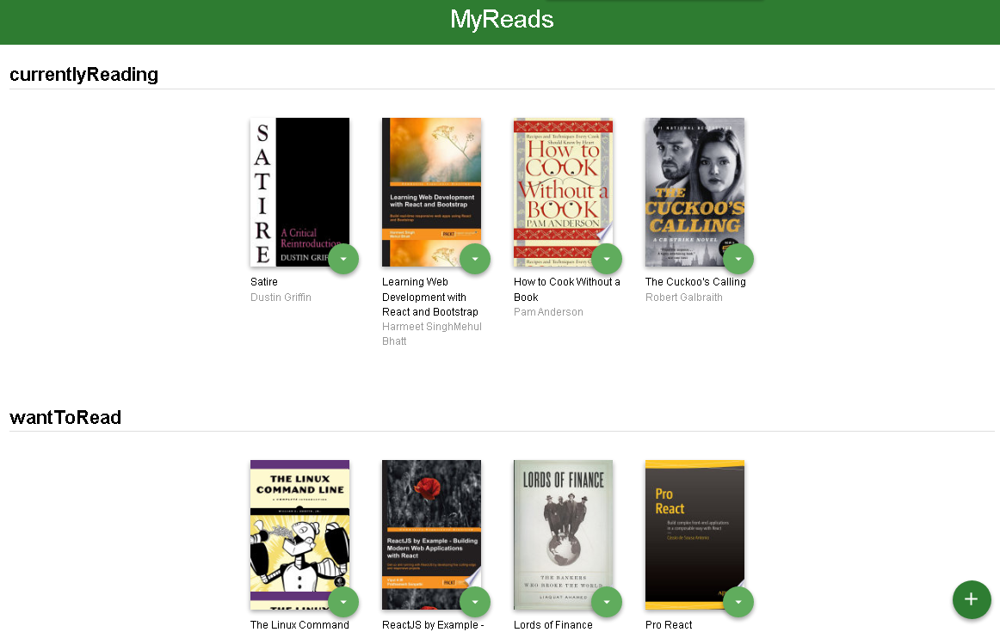
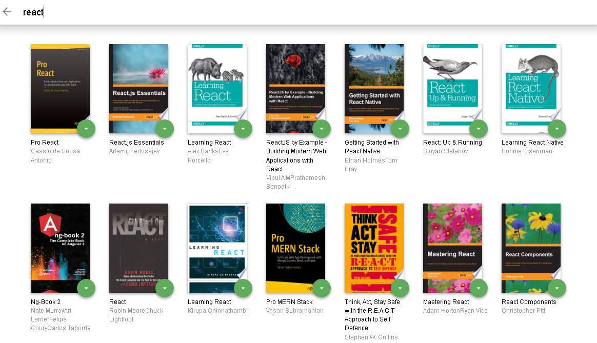

# MyReads: A Book Tracking App
MyReads web app is created using React.js as a part of the [Udacity's React Nanodegree program](https://github.com/udacity/nd0191-c1-myreads).

## About
This is a single-page app (navigation happens without the need to refresh pages), and it represents a virtual bookcase to store your books and track what you're reading.
MyReads lets you manage your digital bookshelf. It supports three shelves:
- Currently Reading
- Want to Read
- Read




## TL;DR

To get started developing right away:

- install all project dependencies with `npm install`
- start the development server with `npm start`

## What You're Getting

```bash

├── README.md - This file.
├── SEARCH_TERMS.md # The whitelisted short collection of available search terms for you to use with your app.
├── package.json # npm package manager file. It's unlikely that you'll need to modify this.
├── public
│   ├── favicon.ico # React Icon, You may change if you wish.
│   └── index.html # DO NOT MODIFY
└── src
    ├──components
        ├──Book.js
        ├──BookShelf.js
        ├──BookShelves.js
        ├──Noresult.js
        ├──search.js
    ├── App.css # Styles for your app. Feel free to customize this as you desire.
    ├── App.js # This is the root of your app. Contains static HTML right now.
    ├── BooksAPI.js # A JavaScript API for the provided Udacity backend. Instructions for the methods are below.
    ├── icons # Helpful images for your app. Use at your discretion.
    │   ├── add.svg
    │   ├── arrow-back.svg
    │   └── arrow-drop-down.svg
    ├── index.css # Global styles. You probably won't need to change anything here.
    └── index.js # You should not need to modify this file. It is used for DOM rendering only.
```

## Backend Server

To simplify your development process, we've provided a backend server for you to develop against. The provided file [`BooksAPI.js`](src/BooksAPI.js) contains the methods you will need to perform necessary operations on the backend:

- [`getAll`](#getall)
- [`update`](#update)
- [`search`](#search)

### `getAll`

Method Signature:

```js
getAll();
```

- Returns a Promise which resolves to a JSON object containing a collection of book objects.
- This collection represents the books currently in the bookshelves in your app.

### `update`

Method Signature:

```js
update(book, shelf);
```

- book: `<Object>` containing at minimum an `id` attribute
- shelf: `<String>` contains one of ["wantToRead", "currentlyReading", "read"]
- Returns a Promise which resolves to a JSON object containing the response data of the POST request

### `search`

Method Signature:

```js
search(query);
```

- query: `<String>`
- Returns a Promise which resolves to a JSON object containing a collection of a maximum of 20 book objects.
- These books do not know which shelf they are on. They are raw results only. You'll need to make sure that books have the correct state while on the search page.

## Important

The backend API uses a fixed set of cached search results and is limited to a particular set of search terms, which can be found in [SEARCH_TERMS.md](SEARCH_TERMS.md). That list of terms are the _only_ terms that will work with the backend, so don't be surprised if your searches for Basket Weaving or Bubble Wrap don't come back with any results.

## Contributing.

For details, check out [CONTRIBUTING](https://github.com/udacity/nd0191-c1-myreads).

### Author

👤 **Muhmmd Usama** 
- GitHub: [@muhmmdusama](https://github.com/muhmmdusama)
- Twitter: [@muhmmdusama](https://twitter.com/muhmmdusama)
- LinkedIn: [muhmmdusama](https://linkedin.com/in/muhmmdusama)
